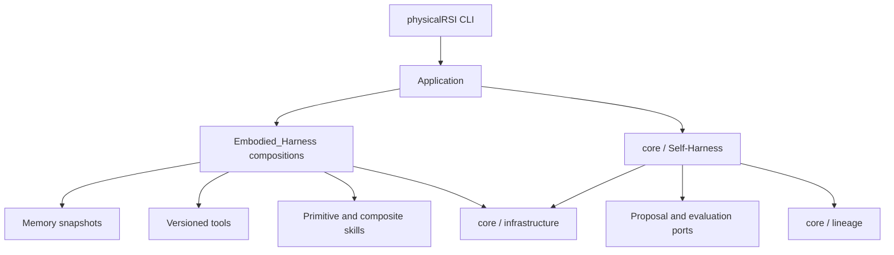

# Architecture

## Ownership and composition

`PhysicalRSI/Embodied_Harness` is the shared capability domain for Memory, Tool, and Skill. These capabilities can call one another and can be composed through explicit contracts. `PhysicalRSI_core` owns the single Self-Harness loop and the infrastructure layer; it does not import the capability domain, the CLI, or a baseline implementation. The application injects proposal, evaluation, selection, and capability components.

Every capability exposes an `Operation` with an explicit name, revision, input, output, call, and effect set. `Contract` records semantic type, units, coordinate frame, and embodiment. Serial composition requires exact adjacent contracts; conversions must be explicit tools. Parallel branches receive independent input copies, must have disjoint effects, and return an ordered tuple for an explicit join.

Memory snapshots are content-addressed and verified on read. Creating a snapshot does not replace the active capability set or grant qualification. A changed dependency requires a new revision and a new composition.

## Self-Harness and lineage

The bounded Self-Harness loop is: development feedback, proposal, admission, frozen comparison pool, fresh validation input, paired evaluation, selection, and compare-and-swap inheritance. Memory, Skill, and Tool changes are evaluated as one dependency-closed candidate. Digests, raw evidence, budgets, comparison identity, failures, and rejection reasons are persisted.

The preview labels these two timescales explicitly. **System 1** is the runtime
loop: it reads the current observation, task skill_choice, and immutable memory snapshot,
then executes one of the bound skills and records the episode state. **System 2**
is the development loop: it consumes development evidence, proposes skill or
memory changes, admits candidates, evaluates them on fresh inputs, selects a
survivor, and commits lineage. System 2 may change what System 1 will execute;
it is not invoked for every action step. The distinction is a functional
boundary, not a claim that two separate neural networks are always required.

The Robodojo baseline exposes three core skill roles. `pi05` is a provider-backed
policy skill, `pi05-sparse-memory` is the provider-backed policy skill with causal
visual history, and `code-policy` is the exploration skill produced from paired
development evidence. Task skill_selection selects one of these roles and binds it to an
immutable exploration-memory revision. The CPU-only
`PhysicalRSI_demos.skill_memory` catalog demonstrates this relationship without
claiming model inference or physical qualification.

Lineage checks versions and evidence, detects concurrent parent changes, and records rollback as a new history version. Completed stages can resume; an external stage that started without a confirmed completion requires reconciliation before another attempt.

## Infrastructure

The infrastructure layer provides atomic storage, POSIX locking, bounded execution, resource pools, managed process groups, service startup and cleanup, RPC transports, request journals, execution events, trajectories, and optional dataset export. It records action identity, capability version, inputs, outputs, duration, failures, and post-action observations. Local cancellation is cooperative; distributed scheduling, dynamic batching, and cross-process GPU allocation are outside this preview.

## User-facing paths

The product has two workflows: demo and baseline. `/demo` loads the local Memory → Tool → Skill example, which `/run` executes. `/task` loads a task package; `/baseline` runs the shared preflight check and then invokes the task's baseline once. Both workflows use the same `Application` command table and execution layer. Configuration and inspection commands support these workflows. An optional model turns natural-language requests into bounded tool calls; model conversation is not capability state or version truth.

Task packages use `physicalrsi.task/v1` and provide a factory with `check`, `run`, `evolve`, and `status` operations. Baseline execution reads the committed capability version and reports scope and qualification explicitly. The interface does not infer physical success from the existence of an adapter.

The RoboDojo package is an optional baseline adapter. Its workflow provides task-specific proposal and evaluation logic while inheritance remains in core Self-Harness. Native perception, planning, isolation, and independent scoring still require validation in the target RoboDojo environment.

## Physical experiment boundary

`PhysicalRSI_core/experiments.py` adds a task-independent reset, action, observation and verification runtime. It freezes the case, budget and adapter identities and records raw evidence before returning a verdict. Success, task failure, uncertainty, invalid setup and interrupted execution remain distinct. This boundary is available to task evaluators; the existing Self-Harness continues to own candidate selection and inheritance. See [core](../PhysicalRSI_core/README.md).
